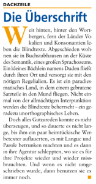
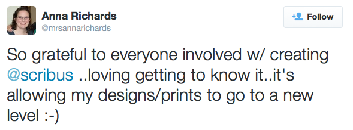
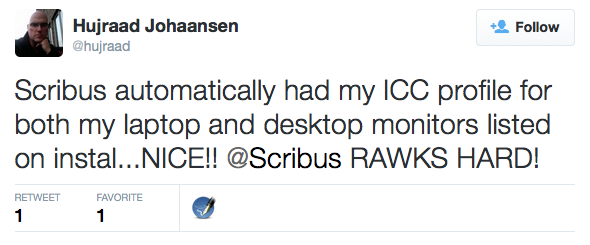
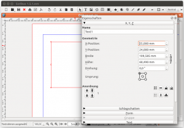
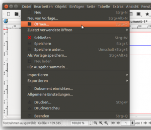
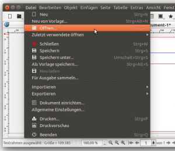

# The Scribus Community Newsletter, November 2015

## Dachzeile

Ein typisches Gestaltungselement von Zeitungen ist die Dachzeile: Das ist eine über der Schlagzeile stehende, zur thematischen Einordnung des Artikels dienende Zeile in kleinem Schriftgrad, der üblicherweise eine Linie über die volle Breite des Artikels folgt. In einem einspaltigen Beispiel sieht das so aus:

dachzeile.png

In Scribus lässt sich eine Dachzeile leider nicht ganz einfach setzen: Es gibt dafür keine Absatzlinien-Funktion, die am Ende eines Absatzes eine Linie zieht. Die Dicke, die Farbe und der Abstand der Linie kann der Benutzer natürlich bestimmen. Ich musste dafür also einen Workaround finden. Mit dem Linienwerkzeug eine Linie zu ziehen und unter die Dachzeile zu pfriemeln ist keine komfortable Lösung (das wäre ja tatsächlich wie Bleisatz).

Nach einigem Experimentieren fand ich folgenden Trick:

1. Zuerst wird die Dachzeile als solche gesetzt - dafür wird ein Stil angelegt.
2. Nach der Dachzeile wird ein Absatz hinzugefügt, dessen "Text" nur aus einem Leerzeichen besteht. Für diesen Absatz wird folgender Stil angelegt: Sehr kleiner Zeilenabstand (in meinem Beispiel 3 Punkt). Format: Blocksatz mit ausgetriebener Ausgangszeile - dadurch wird das Leerzeichen auf die volle Textrahmenbreite ausgetrieben. Zeichenstil: unterstrichen. Dabei kann man die Dicke, den Versatz und die Farbe der Unterstreichung nach Wunsch bestimmen. (Achtung: Die Anzeige der Kontrollzeichen sollte ausgeschaltet werden, sonst sieht man die Linie nicht.)

Der Trick besteht also darin, in einem Absatz mit geringem Zeilenabstand ein unterstrichenes Leerzeichen auf die volle Textrahmenbreite auszutreiben.

Ist etwas um die Ecke gedacht, aber es funktioniert.

This contribution was first published by Manutius in [the German Scribus forum](http://scribus-user.de/forum).

## Scribus 1.4.6 released

TODO: will only be published in November if 1.4.6 is already out before the release of the newsletter (ale)

The newest bug fixing release of the Scribus stable branch has been released. The most relevant changes are:

- Improvement in the translations.
- Apply Transifex sourced translations.
- Text effects only retain on first line when you reopen a document.
- Improve the color management consistency between PostScript and PDF CMYK output.
- Better color management for print preview when GhostScript >= 9.00 is available.
- Retain "View rulers" setting across session.
- Fix drag and drop issue on main window on Windows.
- Retain the transparency of layers for object placed in template when exporting in PDF.
- Extend the maximum display DPI to 500 to allow for current 4k, 5k, and future screens.
- Apply patch to use `CMAKE_INSTALL_DATAROOTDIR`.
- Avoid the creation of an `XObject` for every group on every page when exporting to PDF.
- Fix small scaling error when importing SVGs with viewbow attribute.
- Correctly render the kerning between non-CJK and CJK letters.
- Refresh the content when deleting a linked text frame.
- Fix flipping horizontal/vertical not moving the items back if multiple are selected.

## Testimonials

## Requests for participation

## Feedback

### Issues with new icons on dark background

cf. <http://www.scribus-user.de/forum/viewtopic.php?f=24&t=209&p=1337&hilit=icons#p1337>

The new set of icons we have have presented last month "is auf viel interesse gestossen". During his tests on Ubuntu, Julius noticed an issue when the icons are rendered on the menus dark background:

Being involved in the german community on [scribus-user.de](http://scribus-user.de/forum/) he has [started a discussion](http://www.scribus-user.de/forum/viewtopic.php?f=24&t=209) that we want to share with you.

Lösen ließe sich dies, indem auch ein helles Icon-Set entwickelt würde. Das würde allerdings nicht zur hellen Werkzeugleiste passen. Es wäre also nötig, hierfür zwei verschiedene Icon-Sets benutzen zu können (Mockup mit GIMP):

Alternativ könnte man auch die Icons zur „Laufzeit“ in der gleichen Farbe wie die Schrift im jeweiligen Menü / Werkzeugleiste einfärben (mit den neuen monochromen Icons wäre das ja rein theoretisch möglich).

Wie und ob dies realisierbar ist, kann ich allerdings nicht beurteilen...

## Events

### Makerday 14. November 2015 in der Stadtbibliothek Winterthur (Schweiz)**

Am Makerday vom 14. November 2015 verwandelt sich die Stadtbibliothek in einen Marktplatz für Ideen und Wissen. Unter anderem:

<http://bibliotheken.winterthur.ch/stadtbibliothek/veranstaltungen/makerday/>  

10:30 Erstellung von E-Books  
12:30 Scribus  
13:30 GIMP  
15:30 Inkscape

## Requests for participation

## About this newsletter

This is a Scribus newsletter published by contributors from the Scribus community.
Our goal is to produce one issue per month presenting different aspects of the life in the Scribus community.

TODO: complete the contributors list  
The October issue has been written by Ale and Kunda

You can contribute through our Github repository <https://github.com/aoloe/scribus-newsletter> or by getting in touch with us in any way you see fit ([forum](http://forums.scribus.net), [IRC](http://webchat.freenode.net/?channels=scribus), [mailing list](http://lists.scribus.net), [twitter](https://twitter.com/scribus), email, ...)

Currently we are looking for more redactors, translators, and a graphic designer who proposes a nice HTML style for this newsletter.  
We would also like to see designers create a PDF version of each issue.

You can also ask us to cover specific topics, by commenting on the [ticket for the next issue](https://github.com/aoloe/scribus-newsletter/issues/14)).

This newsletter is published under a Creative Common license:  
CC-BY-SA, the Scribus Community Newsletter (<http://impagina.org/newsletter>)
